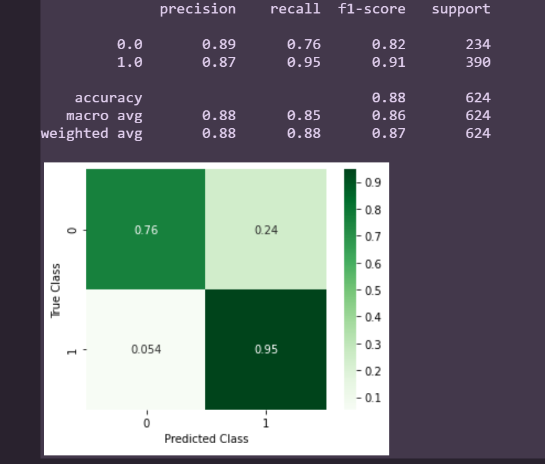
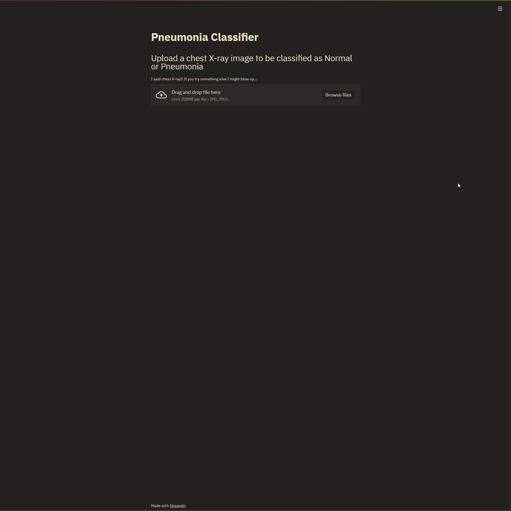

# Classifying Pneumonia with CNNs

## Overview

This project goes through the process of developing a Convolutional Neural Network with Tensorflow and Keras in order to detect healthy lungs versus those that are infected with pneumonia.

## Business Problem

The goal of this project is to help radiologists work more effectively and efficiently by providing a tool they can use to pre-screen chest X-rays to implement a triage system with minimal to no human overhead.

## Data

The data was gathered from [Kaggle](https://www.kaggle.com/paultimothymooney/chest-xray-pneumonia). The data files provide a pre-split folder breakdown of test/train/validation files while also being separated into each class, normal/pneumonia.

## Results

After several iterations, our best model had an 88% accuracy but was able to correctly classify pneumonia at a rate of 95%. Due to the existing class imbalance, the null accuracy would be 62% if the model labeled everything as Pneumonia. Our model was able to provide a significant improvement from the null accuracy and with a True Positive rate of 95% and a True Negative rate of 76%. 

## Recommendations

This analysis leads to three recommendations should you work to attain or improve upon the results of this model:

 * More data
   * While there were about 5 thousands images total given within the dataset. I believe that better results could be gathered if there was more data for the model to train on. CNN's will always benefit from more data as long as there are enough resources available to process it effectively.
 * Transfer Learning
   * Using transfer learning from a model that was pre-trained on x-rays with and without pneumonia would yield better results in less time and with less resources. You'll spend less time iterating on network variations as the pre-trained model will already have done most of the work. Fine tuning will take considerably less time and resources and yield just as good if not better results from the right model.
 * Resources
   * Before you decide to get into CNN's, be sure you have the appropriate resources available to you. Training a CNN over thousands of images is going to take a long time and a lot your computer's resources if you don't have sufficient RAM or GPU. If you don't have the hardware available to you, there are cloud services such as Google Colab that offer access GPU processers virtually through the cloud at low to no cost. 

### Next Steps

Given more time I would look forward to implementing the following:

* Image Augmentation
    * Given the same dataset I would implement image augmentation to provide additional usable images for the model to train on to improve the results.
* Transfer Learning
    * Identify an appropriate pre-trained model to improve the results and fine tune the model with this additional data.
* Build Application
    * Build out the prototype application as a live web or desktop app to provide an interactive tool that can be used to classify images by dragging and dropping images or folders.
    * Current version of the app is not fully functional but can be launched by running <streamlit run app.py> from the command line.

